# MERN STACK BOOK STORE PROJECT

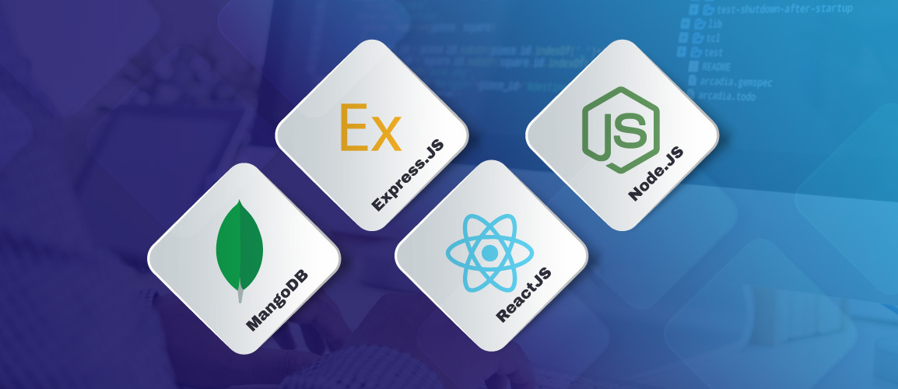

## What is MERN STACK
The MERN stack is a full-stack web development framework that utilizes MongoDB as the database, Express.js as the web application framework, React.js for building user interfaces, and Node.js as the runtime environment.

## What is MongoDB
MongoDB is a NoSQL, document-oriented database that falls under the category of a non-relational database management system. Unlike traditional relational databases, MongoDB does not use tables and rows to store data. Instead, it stores data in flexible, JSON-like documents with dynamic schemas. Each document can have a different structure, allowing for easy scalability and adaptation to evolving data requirements. MongoDB is designed to handle large amounts of unstructured or semi-structured data and provides high performance, horizontal scalability, and support for complex queries through its flexible document model. It is particularly well-suited for applications with rapidly changing and diverse data, making it a popular choice for modern web and mobile development.

## Initial Project Structure

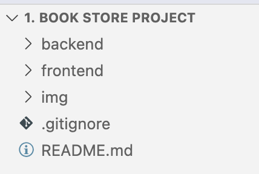

> Step 1: Navigate to backend directory and run:

```
cd ./backend
```
```
npm init -y
```

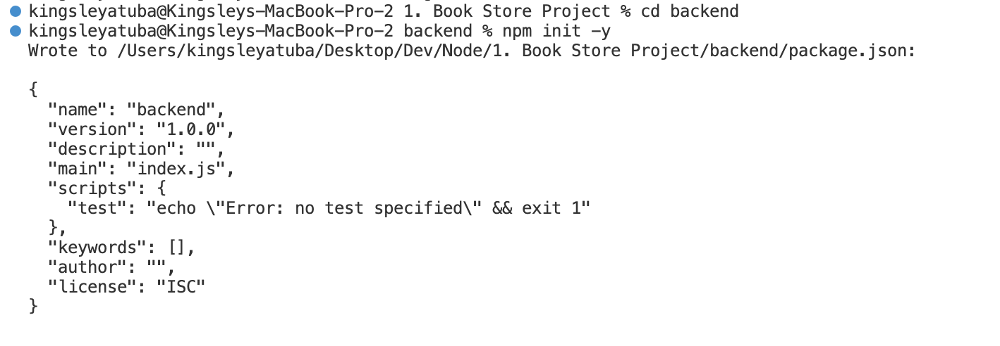

> Step 2: Navigate to package.json in backend directory and add `"type": "module",`

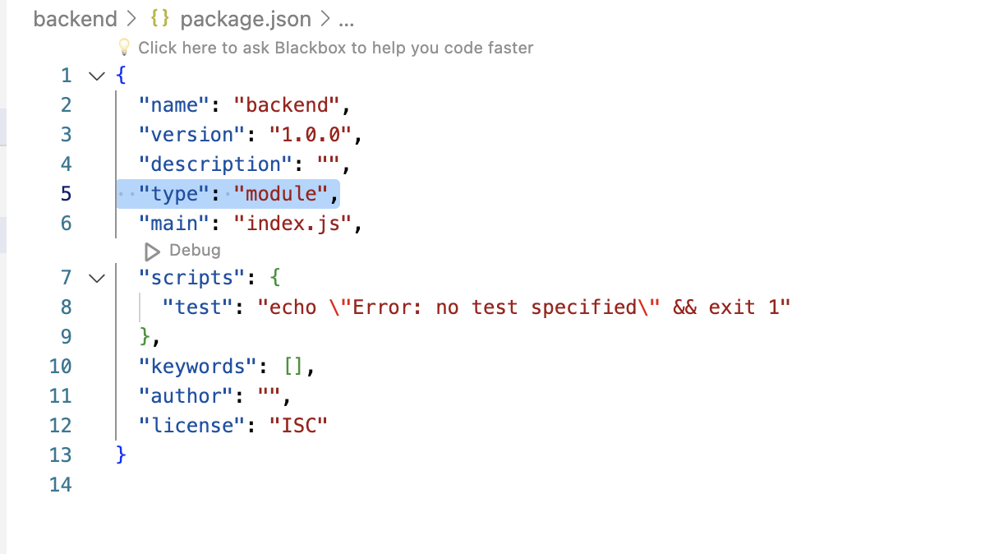

> Step 3: Still in package.json in backend directory. Remove the test scripts and add these scripts: 

```
"start": "node index.js",
"dev": "nodemon index.js"
```

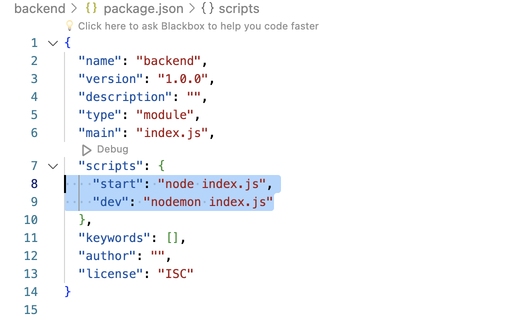

> Step 4: Install Express and Nodemon 

```
npm install express --save
```
```
npm install -g nodemon
```

> Step 5: Create index.js and config.js in the backend directory and fill them with the content below:

```
code ./backend/index.js ./backend/config.js
```

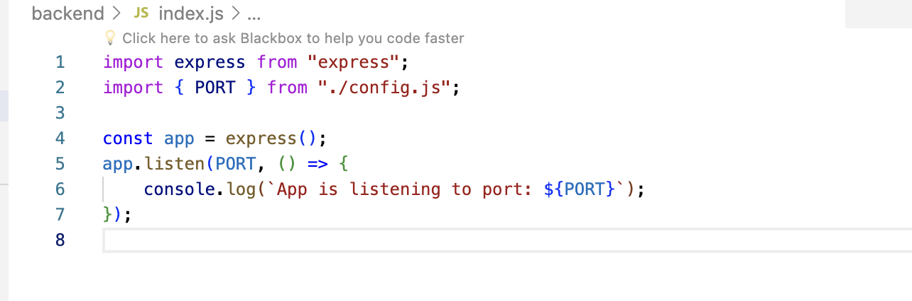
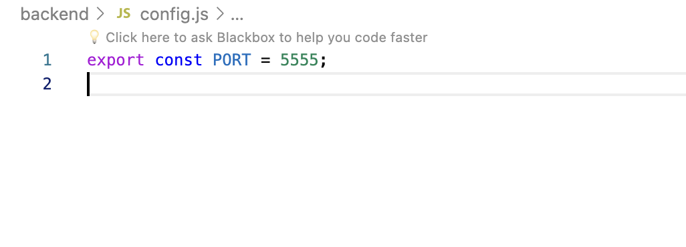

> Step 6: Run your application using the "dev" script added ealier

```
npm run dev
```
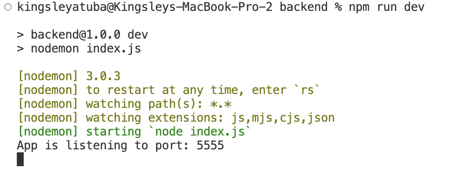

> Step 7: visit on your browser:

```
http://localhost:5555/
```

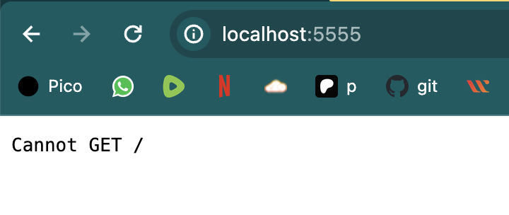

_The "Cannot GET /" error in Express typically indicates that there is no defined route for the requested URL, and you need to ensure that your routes are properly set up in your Express application._

> Step 8: Update your index.js with the code below ad run `npm run dev` again:

```
app.get('/', (request, response) => {
  console.log(request);
  return response.status(200).send('Welcome To MERN Stack Tutorial');
});

```
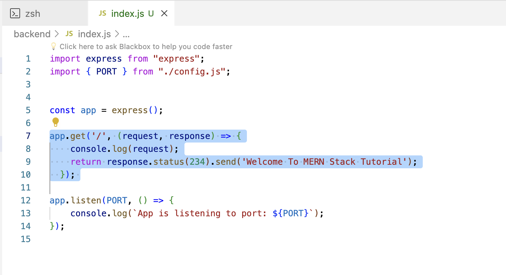
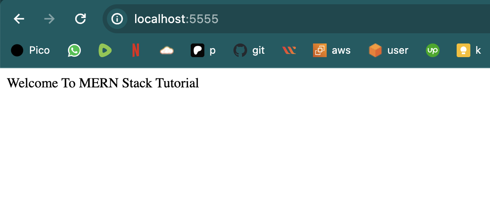

_The added code is an Express.js route definition. When a GET request is made to the root path ("/"), the provided arrow function is executed. The function takes two parameters, request and response. The console.log(request) statement logs the incoming request object to the console for debugging or inspection purposes. Subsequently, the response.status(200).send('Welcome To MERN Stack Tutorial') sets the HTTP status code to 200 OK and sends the specified message, "Welcome To MERN Stack Tutorial," as the response to the client. This code snippet represents a standard approach in Express for handling a root route, where a successful response with a welcome message is provided to the client._


## Add Mongodb and Mongoose to your Application

> Step 9: Visit and sign in to `mongodb.com`:

- Create a project or click on existing project.
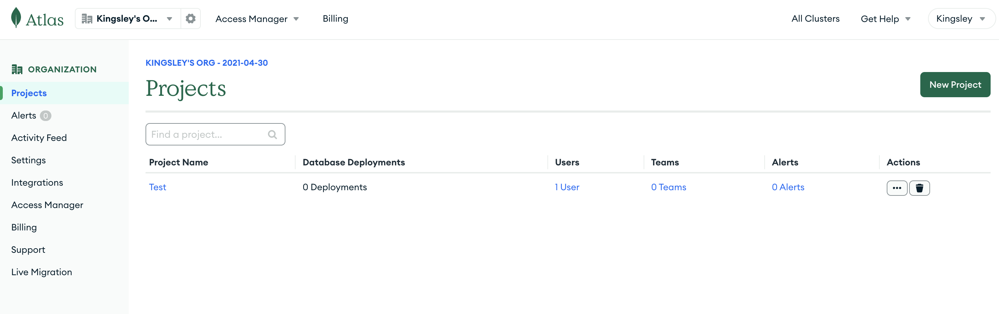

- Once in the project, create a database.
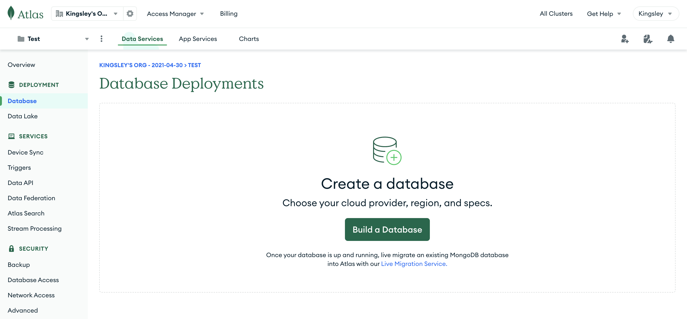

- Select the options below:
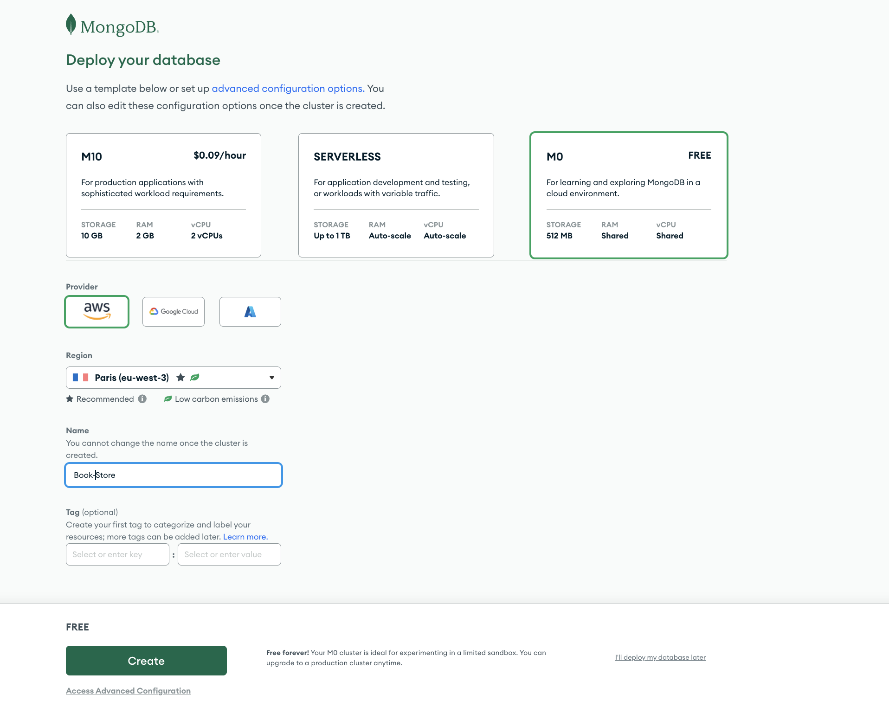

- Create your username and password
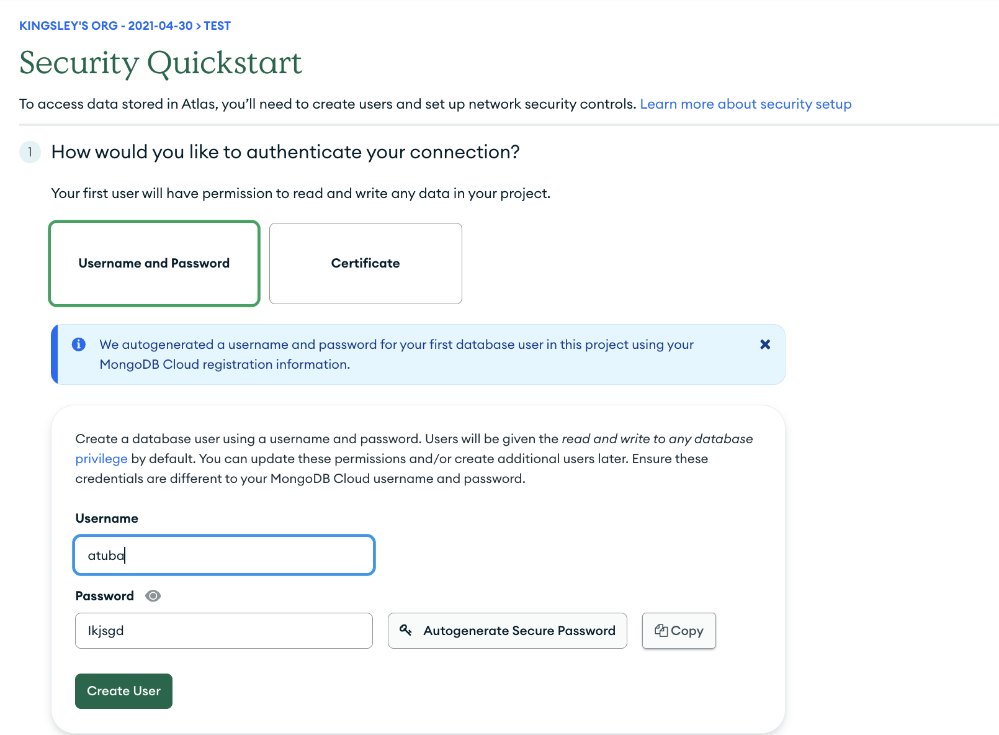

- Finish and create
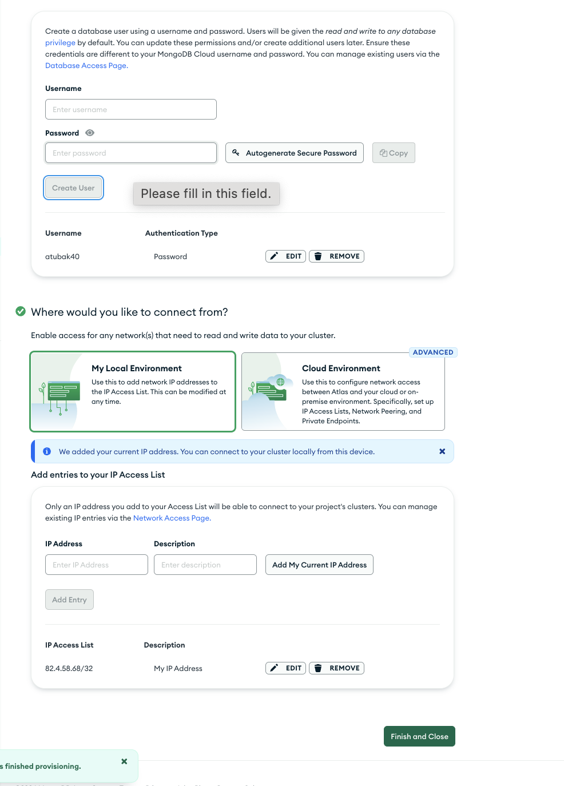

- Go to Overview and Connect
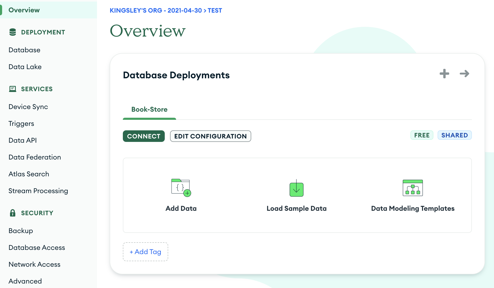

- Click on Drivers
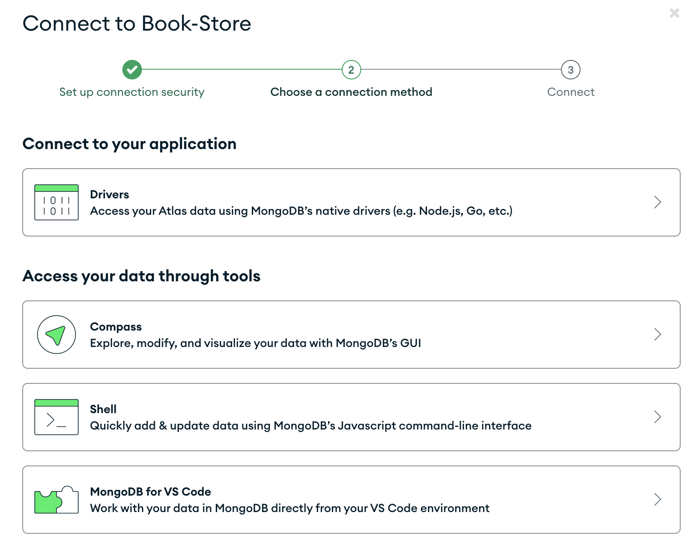

- Perform steps 1, 2 and 3
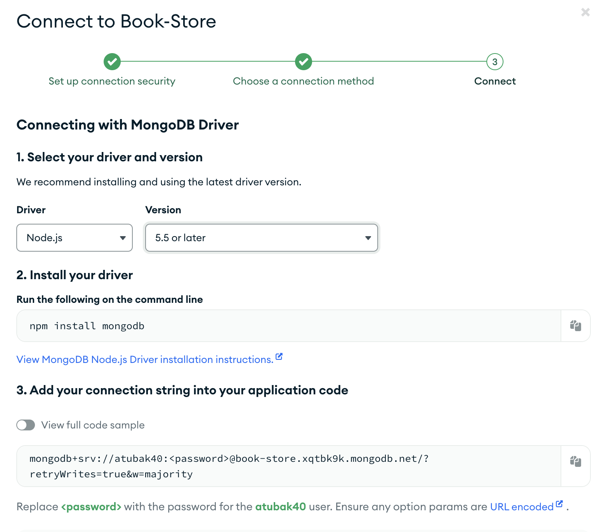


> Step 10: Update your config.js with your database connection.

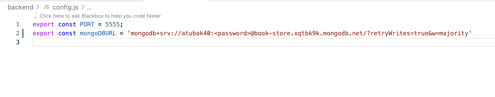
_Dont forget to replace the "`<password>`" placeholder with your password_

> Step 11: Update your index.js with your new database connection Variable.

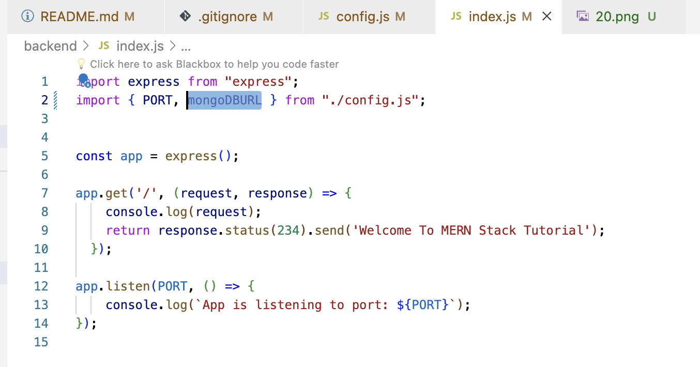


## What is Mongoose Library

Mongoose is a tool that helps Node.js developers work more easily with MongoDB databases by providing a structured way to organize and interact with data. 

Mongoose is advantageous over working directly with MongoDB because it offers a higher-level abstraction, simplifying data modeling, providing schema validation, and offering convenient features like middleware and query building in Node.js applications.


> Step 11: Install Mongoose

```
npm install mongoose

```


> Step 12: Update your index.js with the code below:

```
import express from "express";
import mongoose from "mongoose";
import { PORT, mongoDBURL } from "./config.js";


const app = express();

app.get('/', (request, response) => {
    console.log(request);
    return response.status(234).send('Welcome To MERN Stack Tutorial');
  });  

  mongoose.connect(mongoDBURL)
  .then(() => {
    console.log('App connected to the database');

    app.listen(PORT, () => {
      console.log(`App is listening to port: ${PORT}`);
    });
  })
  .catch((error) => {
    console.log(error);
  });
```

> Step 13: Run `npm run dev` in your backend again:

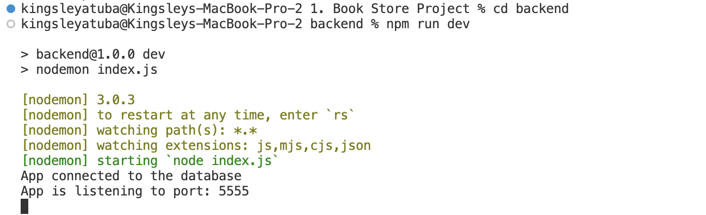

_As you can see, app is connected to database and listening on port 5555_


> Step 14: Create a models folder in your backend and add the file below in it:

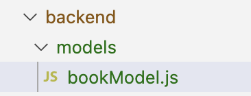

- _bookModel.js_
```
import mongoose from "mongoose";

const bookSchema = mongoose.Schema({
  title: {
    type: String,
    required: true,
  },
  author: {
    type: String,
    required: true,
  },
  publishYear: {
    type: Number,
    required: true,
  },
}, {
  timestamps: true,
});

export const Book = mongoose.model('Book', bookSchema);
```
- _This code defines a Mongoose schema for a "Book" in a MongoDB database. The schema specifies that each book document must have a title, author, and publishYear, with their respective data types and required constraints. Also, the schema includes a timestamps option, which automatically generates createdAt and updatedAt fields for each document, capturing the creation and last modification timestamps. Finally, it creates a Mongoose model named 'Book' based on the defined schema, allowing for easy interaction with the MongoDB database, including operations such as creating, querying, updating, and deleting book documents within a Node.js application using the Mongoose library._

> Step 15: Save a new Book with mongoose by adding these two lines in your index.js:

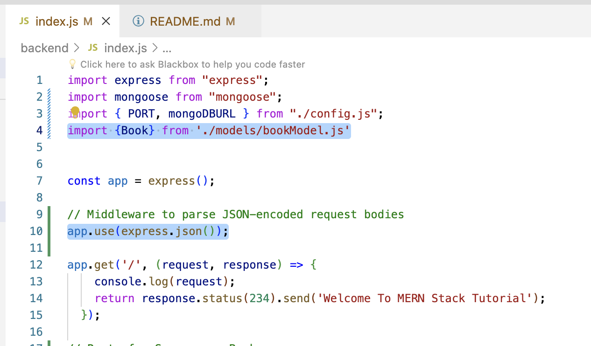

and add the route below to your index.js as well:

```
// Route for Save a new Book
app.post('/books', async (request, response) => {
  try {
    if (
      !request.body.title ||
      !request.body.author ||
      !request.body.publishYear
    ) {
      return response.status(400).send({
        message: 'Send all required fields: title, author, publishYear',
      });
    }

    const newBook = {
      title: request.body.title,
      author: request.body.author,
      publishYear: request.body.publishYear,
    };

    const book = await Book.create(newBook);

    return response.status(201).send(book);
  } catch (error) {
    console.log(error.message);
    response.status(500).send({ message: error.message });
  }
});
```

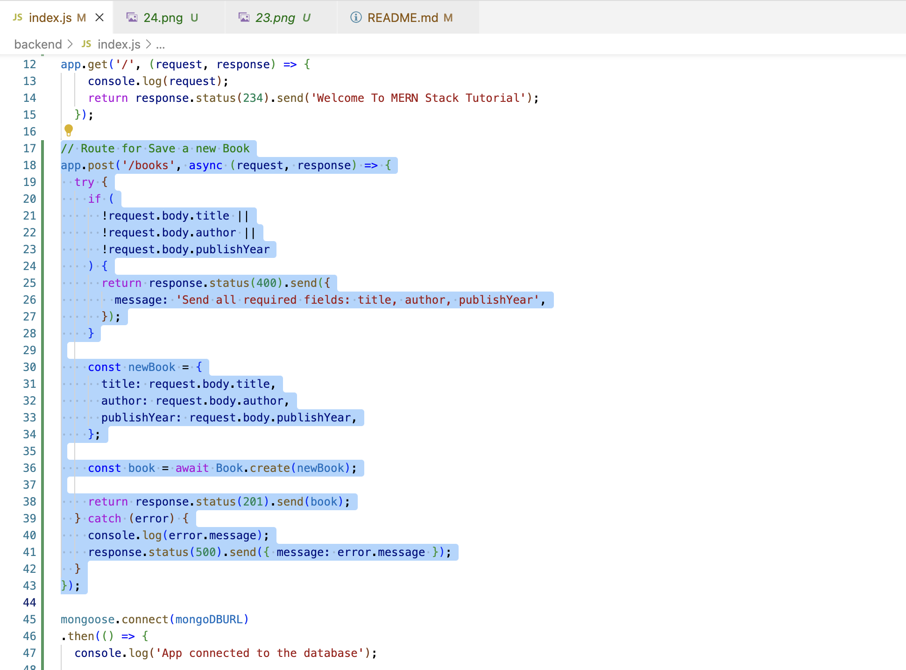

_this route is responsible for handling the creation of new book entries, ensuring that the necessary fields are present, and responding appropriately to success or failure in the book creation process._

> Step 16: Explanation of `app.use(express.json());`
- _The middleware app.use(express.json()) is necessary to enable the Express application to parse JSON-encoded request bodies. When a client sends a POST or PUT request with data in the request body, that data is typically transmitted in JSON format. Without the JSON middleware, the Express application would not automatically parse and make this data available in the request.body object. By using express.json(), the application is equipped to automatically parse incoming JSON data and populate request.body with the appropriate JavaScript object, facilitating easy access and manipulation of the data within route handlers. This middleware is essential for handling JSON data in a clean and efficient manner, ensuring that developers can seamlessly work with JSON payloads in their routes._


## What is Postman

Postman is a collaborative API development platform that simplifies testing, designing, and documenting APIs, facilitating efficient communication and validation of API functionalities.

To save a book to a MongoDB database, Postman can be utilized to test and verify the functionality of your API endpoint responsible for creating new book entries. Using Postman, you can craft a POST request with a JSON payload representing the book details, including the title, author, and publish year. This allows you to simulate a client making a request to your '/books' endpoint without needing to implement a front-end interface. 

Postman provides a user-friendly environment to inspect the response, check for potential errors, and ensure that the book creation process is working as expected. Additionally, you can leverage Postman's testing capabilities to automate checks on the response, validating that the API behaves correctly and that data is successfully stored in your MongoDB database. This testing process in Postman is crucial for verifying the correctness of your API before integrating it into your application, ensuring a smooth interaction between your front-end and MongoDB backend.

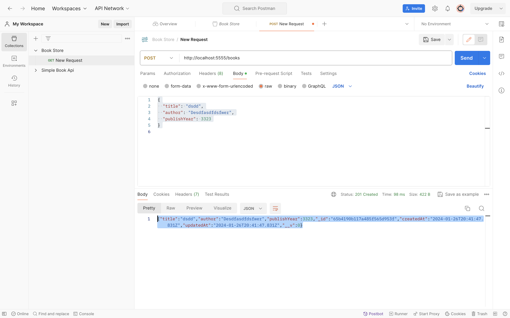

- The image above shows that POST request was successful, and a new book has been created. The response includes the details of the newly created book, such as its title, author, publish year, and other metadata like _id, createdAt, updatedAt, and __v.

_Here's a breakdown of the response:_

_title: "dsdd"_
_author: "Desdfasdfdsfwer"_
_publishYear: 3323_
_id: "65b4190b117a485f565d953f" (this is a unique identifier for the book)_
_createdAt: "2024-01-26T20:41:47.831Z" (timestamp indicating when the book was created)_
_updatedAt: "2024-01-26T20:41:47.831Z" (timestamp indicating when the book was last updated)_
__v: 0 (version number, often used with MongoDB)
_This response indicates that the book was successfully saved in your database, and the server responded with the details of the newly created book._


> Step 16: Add a route to GET All Books from the database

```
// Route for Get All Books from the database
app.get('/books', async (request, response) => {
  try {
    // Attempt to fetch all books from the database using the Book model
    const books = await Book.find({});

    // If successful, respond with a JSON object containing the count and data of the books
    return response.status(200).json({ count: books.length, data: books });

  } catch (error) {
    // If an error occurs during the database operation, log the error message
    console.log(error.message);

    // Respond with a 500 Internal Server Error status and an error message in the JSON format
    return response.status(500).send({ message: error.message });
  }
});
```

> Step 17: Create a new request on Postman and choose GET as the method.  Enter http://localhost:3000/books in the URL bar. Click Send.

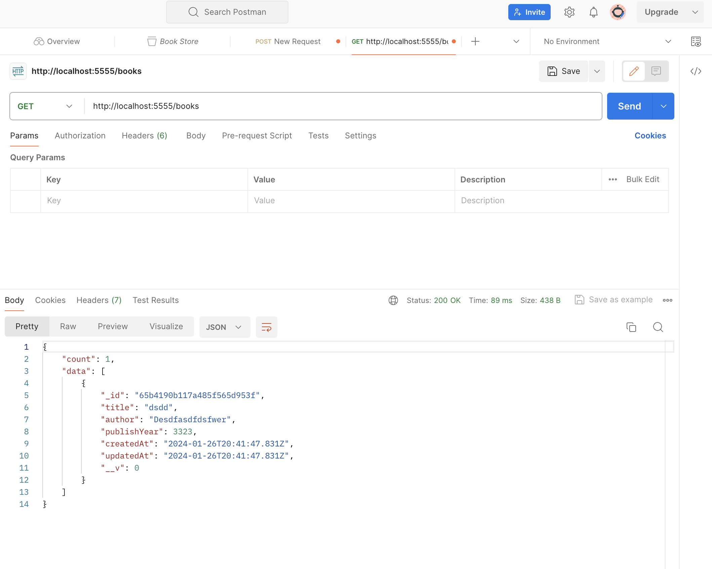

- The image above shows that GET request was successful, and all books were fetched. The resulting JSON represents the response from a server. The response includes a "count" field, indicating the number of books in the "data" array. In this case, there is one book in the array. Each book is represented as an object with properties such as "_id" (a unique identifier), "title," "author," "publishYear," "createdAt" (timestamp of creation), "updatedAt" (timestamp of the last update), and "__v" (version key used by Mongoose). This structured data allows for clear and organized communication between the server and the client, facilitating the display and utilization of book information in an application.


> Step 18: Add a route for Getting one specific Book by its ID

```
app.get('/books/:id', async (request, response) => {
  try {
    const { id } = request.params;
    const book = await Book.findById(id);

    if (!book) {
      return response.status(404).json({ message: 'Book not found' });
    }

    return response.status(200).json(book);
  } catch (error) {
    console.error(error.message);
    response.status(500).send({ message: 'Internal Server Error' });
  }
});
```

> Step 19: Create a new request on Postman and choose GET as the method.  Enter http://localhost:3000/books/<id-goes-here> in the URL bar. Click Send.

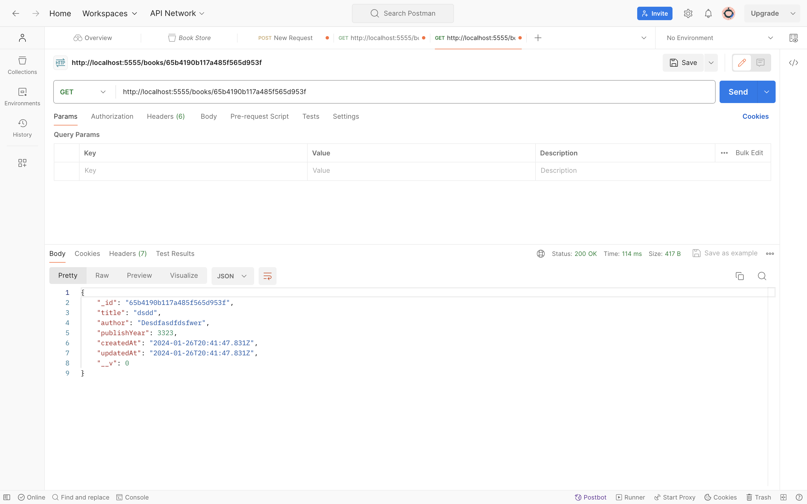